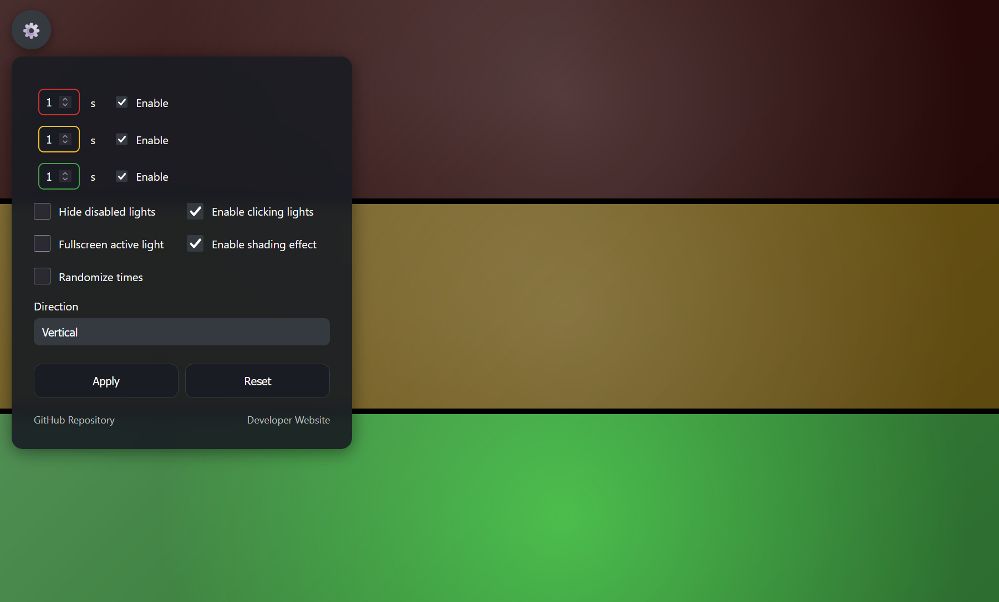
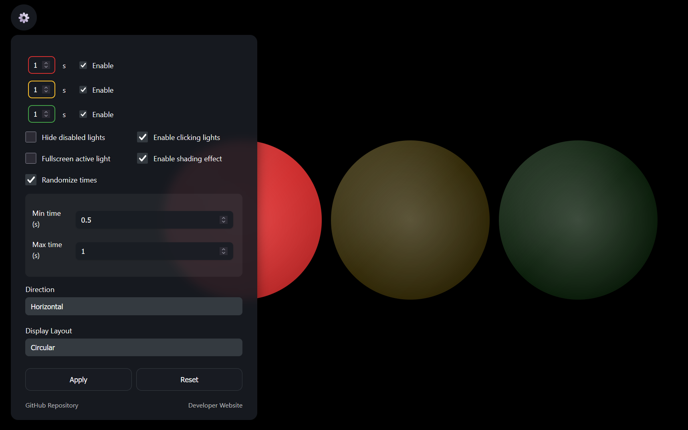

# Traffic Light Display Simulator

A modern, interactive traffic light simulator built with React. Easily adjust light durations, enable/disable lights, switch orientation, and more—all in a beautiful UI.
This web app can also function on mobile device screens, useful for having a portable and small traffic-light color display solution.

[](https://traffic-light-simulator-six.vercel.app/)
[](https://AnahatMudgal.com)

**Used for a robotics project with color detection to simulate an intersection light.**

|  |  |
| ------------------------------------------------------------------------------------------ | ------------------------------------------------------------------------------------------------- |

## Features

_Source code also includes a simple plain HTML, CSS, and JS version with limited functionality._

- **Fully interactive traffic light**: Red, yellow, and green lights cycle automatically.
- **Customizable durations**: Set the time for each light.
- **Enable/disable lights**: Show or hide any color.
- **Hide disabled lights**: Optionally remove disabled lights from the display.
- **Orientation**: Switch between vertical and horizontal layouts.
- **Display layout**: Choose between rectangular and circular traffic light arrangements.
- **Randomized timing**: Enable random durations for each light cycle, with adjustable min/max values.
- **Fullscreen mode**: Option to show only the currently active light, filling the screen for maximum visibility.
- **Responsive design**: Works on desktop and mobile.panel.
- **Additional customization**: Toggle light shading, enable/disable clicking lights, and more advanced settings.
- **Reorder colors**: Drag and drop or use arrows to reorder the sequence of lights.
- **Add/delete custom colors**: Add new custom lights with any color, and remove them as needed.
- **Loop modes**: Choose between Cycle (repeat), Bounce (back & forth), or Random (random order, no repeats until all shown).

## Usage

1. **Install dependencies:**
   ```sh
   npm install
   ```
2. **Start the development server:**
   ```sh
   npm run dev
   ```

## Technologies Used


## Project Structure

- `src/App.tsx` — Main app logic and default settings
- `src/components/TrafficLight.tsx` — Traffic light display
- `src/components/Light.tsx` — Individual light component
- `src/components/SettingsPanel.tsx` — Settings UI (now split into subcomponents)

## Customization

- Edit `defaultSettings` in `App.tsx` to change initial values.
